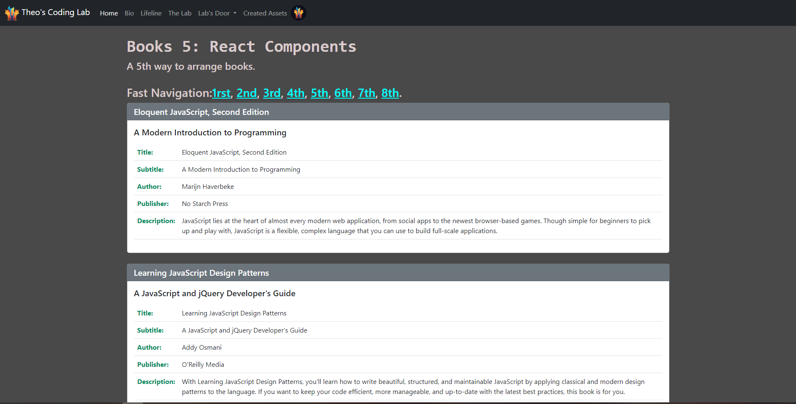
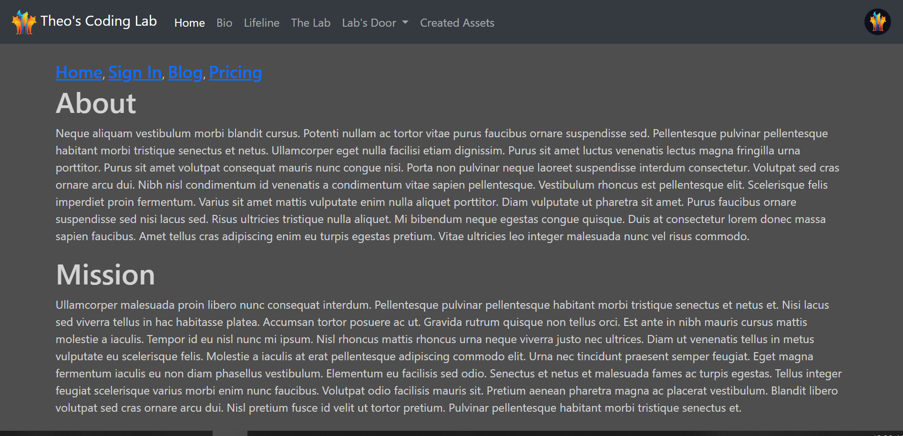

# Module_17
 Bootstrap in React

#  Title of the Repository: Routers and Catalogs

## Description of Repository:

  This Repo consists of the Module 17 exercises, the creation of a book cataloging app, 
and learning inner navigation with # and routers.
 
## How to Use: The Book Catalog:
  It takes a JSON file of books and catalogs them by most relevant information and makes 
them available in an easy to read format.

## Roadmap of future improvements: 
  Adding a search bar would be a useful function for a larger database

## How to Use: Routing:
  One can use the links on top of the page to navigate without needind to hit servers for
more data.

## Roadmap of future improvements: 
  Integrating this onto my portifolio could be useful.

## Appearance:

## Links:
[Exercise 1](https://theobueno.github.io/Module_17/infiniteRouting/i_books.html), 
[Exercise 2](https://theobueno.github.io/Module_17/infiniteRouting/index.html), 
[Repository](https://github.com/TheoBueno/Module_17.git/)

## License information: 

MIT License

Copyright (c) 2023 Theo Bueno

Permission is hereby granted, free of charge, to any person obtaining a copy
of this software and associated documentation files (the "Software"), to deal
in the Software without restriction, including without limitation the rights
to use, copy, modify, merge, publish, distribute, sublicense, and/or sell
copies of the Software, and to permit persons to whom the Software is
furnished to do so, subject to the following conditions:

The above copyright notice and this permission notice shall be included in all
copies or substantial portions of the Software.

THE SOFTWARE IS PROVIDED "AS IS", WITHOUT WARRANTY OF ANY KIND, EXPRESS OR
IMPLIED, INCLUDING BUT NOT LIMITED TO THE WARRANTIES OF MERCHANTABILITY,
FITNESS FOR A PARTICULAR PURPOSE AND NONINFRINGEMENT. IN NO EVENT SHALL THE
AUTHORS OR COPYRIGHT HOLDERS BE LIABLE FOR ANY CLAIM, DAMAGES OR OTHER
LIABILITY, WHETHER IN AN ACTION OF CONTRACT, TORT OR OTHERWISE, ARISING FROM,
OUT OF OR IN CONNECTION WITH THE SOFTWARE OR THE USE OR OTHER DEALINGS IN THE
SOFTWARE.

<Add it to your code: https://opensource.org/license/mit/>